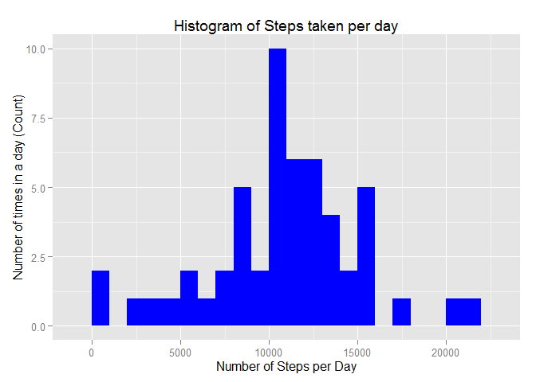
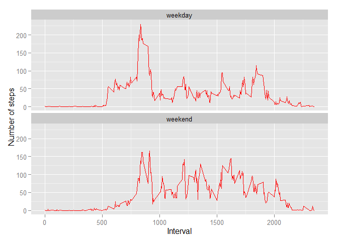

# Reproducible Research: Peer Assessment 1

## Preparing the environment


```r
library(knitr)
```

```
## Warning: package 'knitr' was built under R version 3.1.3
```

```r
opts_chunk$set(echo = TRUE, results = 'hold')

library(data.table)
```

```
## Warning: package 'data.table' was built under R version 3.1.3
```

```r
library(ggplot2)
```


## Loading and preprocessing the data


```r
getwd()
mydata <- read.csv("activity.csv", header = TRUE, sep = ",",
                  colClasses=c("numeric", "character", "numeric"))
```

```
## [1] "C:/Users/Mahima/Documents/GitHub/RepData_PeerAssessment1"
```


```r
mydata$date <- as.Date(mydata$date, format = "%Y-%m-%d")
mydata$interval <- as.factor(mydata$interval)
```


## What is mean total number of steps taken per day?


```r
steps_taken <- aggregate(steps ~ date, mydata, sum)
colnames(steps_taken) <- c("date","steps")
head(steps_taken)
```

```
##         date steps
## 1 2012-10-02   126
## 2 2012-10-03 11352
## 3 2012-10-04 12116
## 4 2012-10-05 13294
## 5 2012-10-06 15420
## 6 2012-10-07 11015
```

The Histogram of the total number of steps taken per day:


```r
ggplot(steps_taken, aes(x = steps)) + 
       geom_histogram(fill = "green", binwidth = 1000) + 
        labs(title="Histogram of Steps taken per day", 
             x = "Number of Steps per Day",
             y = "Number of times in a day (Count)")  
```

 

Mean of the number of steps taken per day:


```r
steps_mean   <- mean(steps_taken$steps, na.rm=TRUE)
```


## What is the average daily activity pattern?


```r
daily_activity <- aggregate(mydata$steps, 
                            by = list(interval = mydata$interval),
                            FUN=mean, na.rm=TRUE)
daily_activity$interval <- 
        as.integer(levels(daily_activity$interval)[daily_activity$interval])
colnames(daily_activity) <- c("interval", "steps")
 
ggplot(daily_activity, aes(x=interval, y=steps)) +   
        geom_line(color="orange", size=1) +  
        labs(title="Average Daily Activity Pattern",
             x="Interval",
             y="Number of steps") 
```

 

```r
max_interval <- daily_activity[which.max(daily_activity$steps),]
```


## Imputing missing values


```r
missing_vals <- sum(is.na(mydata$steps))
```

The total number of ***missing values*** are **2304**.


```r
na_fill <- function(data, pervalue) {
        na_index <- which(is.na(data$steps))
        na_replace <- unlist(lapply(na_index, FUN=function(idx){
                interval = data[idx,]$interval
                pervalue[pervalue$interval == interval,]$steps
        }))
        fill_steps <- data$steps
        fill_steps[na_index] <- na_replace
        fill_steps
}

mydata_fill <- data.frame(  
        steps = na_fill(mydata, daily_activity),  
        date = mydata$date,  
        interval = mydata$interval)

sum(is.na(mydata_fill$steps))

fill_steps_per_day <- aggregate(steps ~ date, mydata_fill, sum)
colnames(fill_steps_per_day) <- c("date","steps")

##plotting the histogram
ggplot(fill_steps_per_day, aes(x = steps)) + 
       geom_histogram(fill = "blue", binwidth = 1000) + 
        labs(title="Histogram of Steps Taken per Day", 
             x = "Number of Steps per Day", 
             y = "Number of times in a day(Count)") 
```

 

```r
steps_mean_fill   <- mean(fill_steps_per_day$steps, na.rm=TRUE)
steps_median_fill <- median(fill_steps_per_day$steps, na.rm=TRUE)
```

```
## [1] 0
```


## Are there differences in activity patterns between weekdays and weekends?


```r
weekdays_steps <- function(data) {
    weekdays_steps <- aggregate(data$steps, by=list(interval = data$interval),
          FUN=mean, na.rm=T)
    # convert to integers for plotting
    weekdays_steps$interval <- 
            as.integer(levels(weekdays_steps$interval)[weekdays_steps$interval])
    colnames(weekdays_steps) <- c("interval", "steps")
    weekdays_steps
}

data_by_weekdays <- function(data) {
    data$weekday <- 
            as.factor(weekdays(data$date)) # weekdays
    weekend_data <- subset(data, weekday %in% c("Saturday","Sunday"))
    weekday_data <- subset(data, !weekday %in% c("Saturday","Sunday"))
    
    weekend_steps <- weekdays_steps(weekend_data)
    weekday_steps <- weekdays_steps(weekday_data)
    
    weekend_steps$dayofweek <- rep("weekend", nrow(weekend_steps))
    weekday_steps$dayofweek <- rep("weekday", nrow(weekday_steps))
    
    data_by_weekdays <- rbind(weekend_steps, weekday_steps)
    data_by_weekdays$dayofweek <- as.factor(data_by_weekdays$dayofweek)
    data_by_weekdays
}

data_weekdays <- data_by_weekdays(mydata_fill)
```


```r
ggplot(data_weekdays, aes(x=interval, y=steps)) + 
        geom_line(color="violet") + 
        facet_wrap(~ dayofweek, nrow=2, ncol=1) +
        labs(x="Interval", y="Number of steps")
```

 

